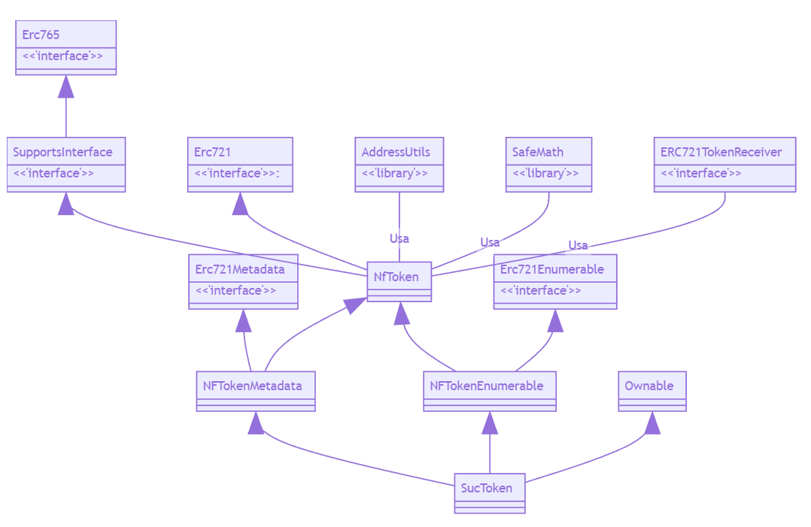

[](https://travis-ci.org/dappsar/suc) &nbsp;
[](https://circleci.com/gh/dappsar/suc/tree/feature%2Fstart) &nbsp;
[](https://coveralls.io/repos/github/dappsar/suc?branch=feature%2Fstart)


# Tokenización de activos de ONG "Salva un Caballo"

## Introducción

Se mantiene en éste repositorio, la implementación de los activos de la ONG "Salva un Caballo", haciendo uso del estándar [ERC-721](https://github.com/ethereum/EIPs/blob/master/EIPS/eip-721.md), para representar los activos mediante un token no fungible ([TNF](https://en.wikipedia.org/wiki/Non-fungible_token)).

Este repositorio, es parte del trabajo de fin de máster (TFM), correspondiente al Máster de blockchain, cripto-economía y Ethereum, de la [Universidad de Alcal](https://www.uah.es/es/).

## Contenido

En éste documento se describe:

- [Estructura del proyecto](https://github.com/dappsar/suc/tree/feature/start#estructura-del-proyecto)
    
    * [Carpetas y archivos](https://github.com/dappsar/suc/tree/feature/start#carpetas-y-archivos)
    * [Diagrama de clases de los contratos e interfaces](https://github.com/dappsar/suc/tree/feature/start#carpetas-y-archivos)

- [Preparación del ambiente](https://github.com/dappsar/suc/tree/feature/start#preparaci%C3%B3n-del-ambiente)

    * [Requisitos](https://github.com/dappsar/suc/tree/feature/start#requisitos)
    * [Instalación](https://github.com/dappsar/suc/tree/feature/start#instalación)

- [Flujo de los fuentes](https://github.com/dappsar/suc/tree/feature/start#floju-de-los-fuentes)

    * Compilación
    * Testing
    * Despliegue
    * Distribución

- [Créditos](https://github.com/dappsar/suc/tree/feature/start#créditos)

---

## Estructura del proyecto

A continuación se describen las carpetas y archivos (del raíz) que forman parte del proyecto. Todos los archivos correspondientes a los contratos y sus tests, se encuentra en la carpeta [src](https://github.com/dappsar/suc/blob/master/src).

### Carpetas y archivos

```bash
├───build               --> Carpeta con los contratos en Json
├───doc                 --> Documentación del proyecto
├───images              --> Algunas imagenes del readme
└───src
    ├───contracts       
    │   ├───math        --> Support Math Utils Library
    │   ├───ownership   --> Support Ownable Contract
    │   ├───principal   --> NFT Principal
    │   ├───tokens      --> Support ERC721 Interfaces (enumerable, metadata, receiver)
    │   └───utils       --> Supports libraries (ERC165, AddressUtils and Supports Interface)
    └───tests           
        ├───principal   --> Contract Tests
        └───tokens      --> Javascript Tests
├───.babelrc            --> Configuración de [Babel](https://babeljs.io/docs/en/)
├───.coveralls.yml      --> Configuración de [Coveralls.io](https://coveralls.io/)
├───.editorconfig       --> Configuración para el editor
├───.env.sample         --> Ejemplo de archivo de configuración de entorno con las variables para truffle
├───.eslintignore       --> Archivos / carpetas a ser ignoradas por [esLint](https://eslint.org/docs/user-guide/configuring)
├───.eslintrc.js        --> Configuración de [esLint](https://eslint.org/docs/user-guide/configuring), para "linting" de archivos de javascript
├───.gitattributes      --> Configuración para Git
├───.npmignore          --> Archivos a ser ignorados por NPM
├───.solhint.json       --> Configuración de [solHint](https://protofire.github.io/solhint/), para "linting" código en Solidity
├───.travis.yml         --> Script de circle-ci para Integración contínua
├───LICENSE             --> Licencia de los fuentes
├───package.json        --> El archivo de npm para las dependencias y scripts
├───README.md           --> Este archivo!
├───truffle-config.js   --> Configuración de Truffle
├───tsconfig.json       --> Configuración de TypeScript (los tests)
└── .gitignore          --> Archivos / carpetas a ser ignoradas por git
```


### Diagrama de clases de los contratos e interfaces

Powered by [mermaid](https://github.com/knsv/mermaid)

```mermaid
classDiagram
Erc721Metadata <|-- NFTokenMetadata
NfToken <|-- NFTokenMetadata

Erc721Enumerable <|-- NFTokenEnumerable
NfToken <|-- NFTokenEnumerable

Erc765 <|-- SupportsInterface
SupportsInterface <|-- NfToken
Erc721 <|-- NfToken

Ownable <|-- SucToken
NFTokenMetadata <|-- SucToken
NFTokenEnumerable <|-- SucToken

AddressUtils -- NfToken: Usa
SafeMath -- NfToken: Usa
ERC721TokenReceiver -- NfToken: Usa

Erc721 : <<'interface'>>:
Erc721Enumerable : <<'interface'>>
Erc721Metadata : <<'interface'>>
ERC721TokenReceiver :  <<'interface'>>
Erc765 : <<'interface'>>
SupportsInterface : <<'interface'>>
AddressUtils :  <<'library'>>
SafeMath :  <<'library'>>

```




### Contratos e Interfaces

* [principal/sucToken.sol](src/contracts/principal/sucToken.sol): Es el contrato principal, que tiene la implementación de los activos de la ONG.
- [tokens/nfToken.sol]()
* [tokens/nfTokenEnumerable](src/contracts/tokens/nfTokenEnumerable.sol): 
- [tokens/nfTokenMetadata](src/contracts/tokens/nfTokenMetadata.sol): 
* [tokens/erc721.sol]()
- [tokens/erc721Enumerable.sol]()
* [tokens/erc721Metadata.sol]()
- [tokens/erc721TokenReceiver.sol]()
* [ownershiop/ownable.sol]()
- [math/safeMath.sol]()
* [utils/addressUtils.sol]()
- [utils/erc165.sol]()
* [utils/supportsInterface.sol]()

---

## Preparación del ambiente

Para la ejecución del proyecto, es necesario cumplir con algunos requisitos, que se descrien a continuación. Luego, se detalla cómo relaizar el despliegue del proyecto en ambiente local. 

### Requisitos

En el ambiente local es requerido tener instalado:

- [Git](https://nodejs.org/en/)
- [nodeJs](https://nodejs.org/en/)
- [Ganache](https://truffleframework.com/ganache)
- [Truffle](https://truffleframework.com/)
- [Metamask](https://chrome.google.com/webstore/detail/metamask/nkbihfbeogaeaoehlefnkodbefgpgknn?hl=es)
- [ethereumjs-testrpc](https://www.npmjs.com/package/ethereumjs-testrpc)

---

## Instalación

### PASO 1: Clonación

Descargar el proyecto con git

```
git clone https://github.com/dappsar/suc.git
```

### PASO 2: Instalar dependencias

Instalar las dependencias del proyecto con:

```
npm install
```

Eso generará la carpeta _node_modules_ con todas las dependencias requeridas.

### PASO 3: Iniciar Ganache

Iniciar el cliente ganache que se haya descargado. Por lo general, esto se logra, haciendo doble click en el acceso directo que haya generado la instalación.

---

## Flujo de los fuentes


### Compilación

Para realizar la compilación de los contrato, se tiene que ejecutar el siguiente comando:

```
npm run compile
```

## Testing 

Se está utilizando para probar los smart contracts, el [framework Specron](https://github.com/fulldecent/framework-1).
Se pueden correr los tests realizados para el contrato, con el comando:

```
npm run test
```

Ese comando, llama al framework specron y ejecuta los tests de la carpeta [src/tests](src/tests).


### Migración a una blockchain

Teniendo los contratos compilados e iniciado _Ganache_, se pueden migrar a la blockchain con el siguiente comando:

```
truffle migrate --reset
```

Si se desea desplegar en otra red, diferente a la local, se tiene que usar el parámetro _network_ y tener configurada la red en el archivo _truffle.js_.

```
# Depliegue en Rinkeby
truffle migrate --reset --network rinkeby

# Despliegue en Ropsten
truffle migrate --reset --network ropsten
```

En el archivo de configuración de truffle (truffle-config.js), está configurado la migración para infura.io. 
Para que funcione, es necesario configurar dos variables de entorno: MNEMONIC e INFURA_KEY, con los datos del proyecto que cada uno tenga en Infura. Eso se puede configurar en un archivo .env (Linux) o setear esas variables con un EXPORT (Windows / linux).


---


## Créditos

* La implementación del proyecto, se basa en el código fuente de [0xCert](https://github.com/0xcert/ethereum-erc721), quienes tienen una implementación estándard para tokens no fungibles (NTF) cumpliendo el estándar [ERC-721](https://github.com/ethereum/EIPs/blob/master/EIPS/eip-721.md). 

- Para la realización del diagrama de clases en markdown, usamos [Mermaid](https://github.com/knsv/mermaid), y la ayuda de estee [post](http://mdp.tylingsoft.com/#class-diagram).


