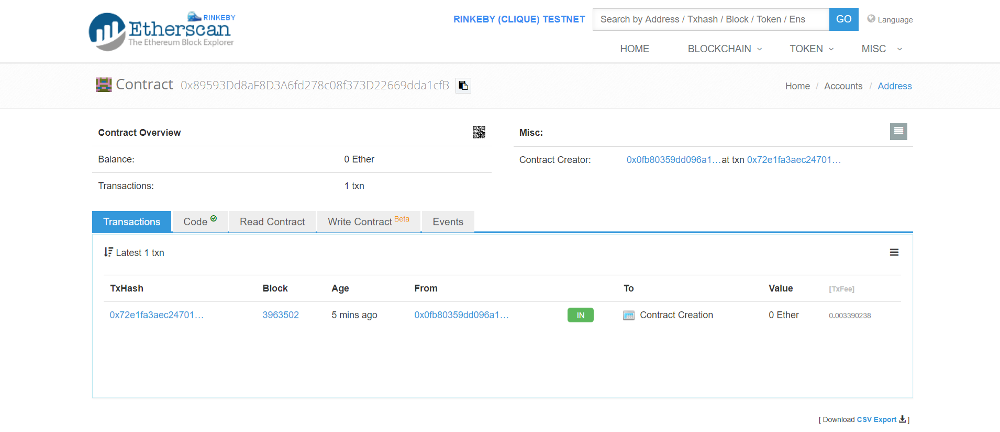
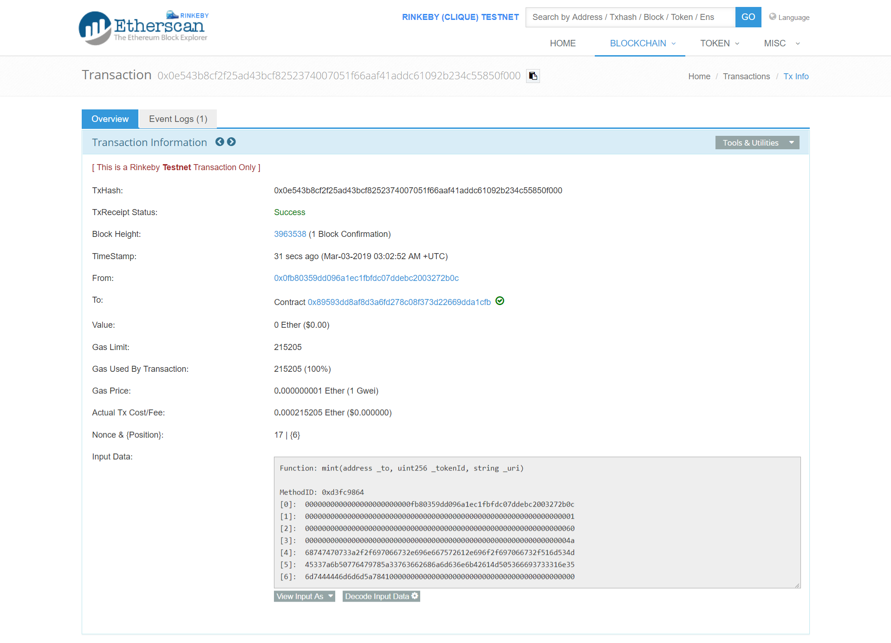
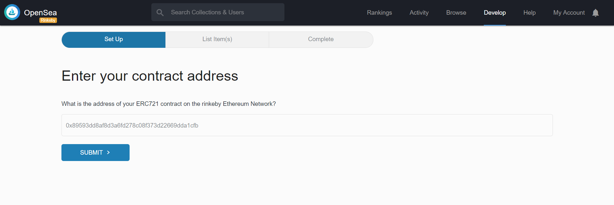
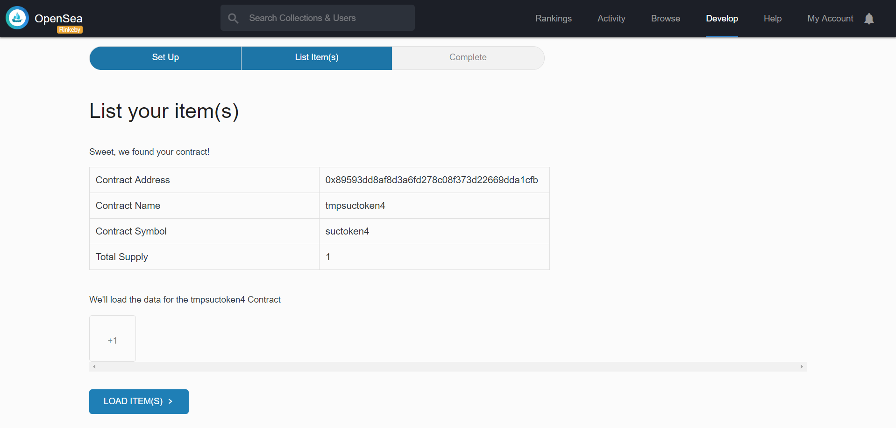
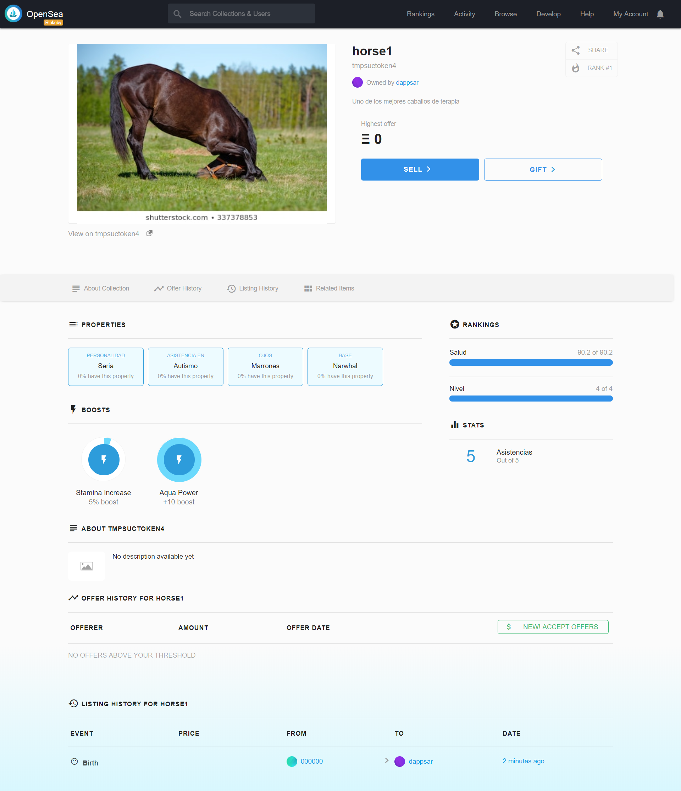

[](https://travis-ci.org/dappsar/suc) &nbsp;
[](https://circleci.com/gh/dappsar/suc/tree/master) &nbsp;
[](https://coveralls.io/repos/github/dappsar/suc?branch=master)


# Tokenización de activos de ONG "Salva un Caballo"

## Introducción

Se mantiene en éste repositorio, la implementación de los activos de la ONG "Salva un Caballo", haciendo uso del estándar [ERC-721](https://github.com/ethereum/EIPs/blob/master/EIPS/eip-721.md), para representar los activos mediante un token no fungible ([TNF](https://en.wikipedia.org/wiki/Non-fungible_token)).

Este repositorio, es parte del trabajo de fin de máster (TFM), correspondiente al Máster de blockchain, cripto-economía y Ethereum, de la [Universidad de Alcalá](https://www.uah.es/es/).

## Contenido

En éste documento se describe:

- [Estructura del proyecto](https://github.com/dappsar/suc/#estructura-del-proyecto)
    
    * [Carpetas y archivos](https://github.com/dappsar/suc/#carpetas-y-archivos)
    * [Diagrama de clases de los contratos e interfaces](https://github.com/dappsar/suc/#carpetas-y-archivos)
    * [Contratos e Interfaces](https://github.com/dappsar/suc/#carpetas-y-archivos)

- [Preparación del ambiente](https://github.com/dappsar/suc/#preparaci%C3%B3n-del-ambiente)

    * [Requisitos](https://github.com/dappsar/suc/#requisitos)
    * [Instalación](https://github.com/dappsar/suc/#instalación)

- [Flujo de los fuentes](https://github.com/dappsar/suc/#floju-de-los-fuentes)

    * [Compilación](https://github.com/dappsar/suc#compilaci%C3%B3n)
    * [Testing](https://github.com/dappsar/suc#testing)
    * [Migración a una blockchain](https://github.com/dappsar/suc#testing)
    * [Minting](https://github.com/dappsar/suc#testing)

- [Despliegue en Marketplaces](https://github.com/dappsar/suc#despliegues-en-marketplaces)

    * [Despliegue en rinkeby usando el compilador web Remix](https://github.com/dappsar/suc#despliegue-en-rinkeby-usando-el-compilador-web-remix)
    * [openSea](https://github.com/dappsar/suc#opensea)
    * [RareBits](https://github.com/dappsar/suc#rare-bits)

- [Créditos](https://github.com/dappsar/suc/#créditos)

---

## Estructura del proyecto

A continuación se describen las carpetas y archivos (del raíz) que forman parte del proyecto. Todos los archivos correspondientes a los contratos y sus tests, se encuentra en la carpeta [src](https://github.com/dappsar/suc/blob/master/src).

### Carpetas y archivos

```bash
├───build               --> Carpeta con los contratos en Json
├───doc                 --> Documentación del proyecto
├───images              --> Algunas imagenes del readme
└───src
    ├───contracts       
    │   ├───math        --> Support Math Utils Library
    │   ├───ownership   --> Support Ownable Contract
    │   ├───principal   --> NFT Principal
    │   ├───tokens      --> Support ERC721 Interfaces (enumerable, metadata, receiver)
    │   └───utils       --> Supports libraries (ERC165, AddressUtils and Supports Interface)
    └───tests           
        ├───principal   --> Contract Tests
        └───tokens      --> Javascript Tests
├───.babelrc            --> Configuración de [Babel](https://babeljs.io/docs/en/)
├───.coveralls.yml      --> Configuración de [Coveralls.io](https://coveralls.io/)
├───.editorconfig       --> Configuración para el editor
├───.env.sample         --> Ejemplo de archivo de configuración de entorno con las variables para truffle
├───.eslintignore       --> Archivos / carpetas a ser ignoradas por [esLint](https://eslint.org/docs/user-guide/configuring)
├───.eslintrc.js        --> Configuración de [esLint](https://eslint.org/docs/user-guide/configuring), para "linting" de archivos de javascript
├───.gitattributes      --> Configuración para Git
├───.npmignore          --> Archivos a ser ignorados por NPM
├───.solhint.json       --> Configuración de [solHint](https://protofire.github.io/solhint/), para "linting" código en Solidity
├───.travis.yml         --> Script de circle-ci para Integración contínua
├───LICENSE             --> Licencia de los fuentes
├───package.json        --> El archivo de npm para las dependencias y scripts
├───README.md           --> Este archivo!
├───truffle-config.js   --> Configuración de Truffle
├───tsconfig.json       --> Configuración de TypeScript (los tests)
└── .gitignore          --> Archivos / carpetas a ser ignoradas por git
```


### Diagrama de clases de los contratos e interfaces

Powered by [mermaid](https://github.com/knsv/mermaid)

```mermaid
classDiagram
Erc721Metadata <|-- NFTokenMetadata
NfToken <|-- NFTokenMetadata

Erc721Enumerable <|-- NFTokenEnumerable
NfToken <|-- NFTokenEnumerable

Erc765 <|-- SupportsInterface
SupportsInterface <|-- NfToken
Erc721 <|-- NfToken

Ownable <|-- SucToken
NFTokenMetadata <|-- SucToken
NFTokenEnumerable <|-- SucToken

AddressUtils -- NfToken: Usa
SafeMath -- NfToken: Usa
ERC721TokenReceiver -- NfToken: Usa

Erc721 : <<'interface'>>:
Erc721Enumerable : <<'interface'>>
Erc721Metadata : <<'interface'>>
ERC721TokenReceiver :  <<'interface'>>
Erc765 : <<'interface'>>
SupportsInterface : <<'interface'>>
AddressUtils :  <<'library'>>
SafeMath :  <<'library'>>

```


### Contratos e Interfaces

* [principal/sucToken.sol](src/contracts/principal/sucToken.sol): Es el contrato principal, que tiene la implementación de los activos de la ONG.
- [tokens/nfToken.sol]()
* [tokens/nfTokenEnumerable](src/contracts/tokens/nfTokenEnumerable.sol): 
- [tokens/nfTokenMetadata](src/contracts/tokens/nfTokenMetadata.sol): 
* [tokens/erc721.sol]()
- [tokens/erc721Enumerable.sol]()
* [tokens/erc721Metadata.sol]()
- [tokens/erc721TokenReceiver.sol]()
* [ownershiop/ownable.sol]()
- [math/safeMath.sol]()
* [utils/addressUtils.sol]()
- [utils/erc165.sol]()
* [utils/supportsInterface.sol]()

---

## Preparación del ambiente

Para la ejecución del proyecto, es necesario cumplir con algunos requisitos, que se describen a continuación. Luego, se detalla cómo relaizar el despliegue del proyecto en ambiente local. 

### Requisitos

En el ambiente local es requerido tener instalado:

- [Git](https://nodejs.org/en/)
- [nodeJs](https://nodejs.org/en/)
- [Ganache](https://truffleframework.com/ganache)
- [Truffle](https://truffleframework.com/)
- [Metamask](https://chrome.google.com/webstore/detail/metamask/nkbihfbeogaeaoehlefnkodbefgpgknn?hl=es)
- [ethereumjs-testrpc](https://www.npmjs.com/package/ethereumjs-testrpc)

---

## Instalación

### PASO 1: Clonación

Descargar el proyecto con git

```
git clone https://github.com/dappsar/suc.git
```

### PASO 2: Instalar dependencias

Instalar las dependencias del proyecto con:

```
npm install
```

Eso generará la carpeta _node_modules_ con todas las dependencias requeridas.

### PASO 3: Iniciar Ganache

Iniciar el cliente ganache que se haya descargado. Por lo general, esto se logra, haciendo doble click en el acceso directo que haya generado la instalación.


### PASO 4: Configurar variables de entorno

El proyecto usa [Infura](https://infura.io/) para el despliegue en las redes de Ethereum y, así, evitar tener configurado un nodo local. Para ello, se requiere configurar las siguienes variables en un archivo de entorno (.env) o definirlas como variables del sistema operativo (con EXPORT o SET):

__Definición en archivo .env:__

(se puede ver un archivo de ejemplo [aquí](.env.sample))

```
- INFURA_KEY="": Key provista por el sitio de infura, para el proyecto que tengamos creado
- MNEMONIC="": las 12 palabras que ayudan a crear la clave privada de la cuenta que tengamos en Metamask
- OWNER_ADDRESS="": Dirección de Metamask que se usará para desplegar los contratos
```

__Definición mediante EXPORT:__

```
export INFURA_KEY="<your_infura_key>"
export MNEMONIC="<metamask 12 mnemonic words>"
export OWNER_ADDRESS="<metamask address>"
```


Estas variables no son necesarias para el despliegue en localhost, pero como se controla su definición para todas las redes, hay que ponerles algún valor por defecto, que para localhost, puede ser cualquier valor distinto de vacío.

---

## Flujo de los fuentes


### Compilación

Para realizar la compilación de los contrato, se tiene que ejecutar el siguiente comando:

```
npm run compile
```

## Testing 

Se está utilizando para probar los smart contracts, el [framework Specron](https://github.com/fulldecent/framework-1).
Se pueden correr los tests realizados para el contrato, con el comando:

```
# Tests con specron
npm run test

# Tests con truffle
# Hay que especificar la carpeta de tests, dado que no lo es la default de truffle
truffle test ./src/tests/truffle/

```

Ese comando, llama al framework specron y ejecuta los tests de la carpeta [src/tests](src/tests).


### Migración a una blockchain

Teniendo los contratos compilados e iniciado _Ganache_, se pueden migrar a la blockchain con el siguiente comando:

```
truffle migrate --reset
```

Si se desea desplegar en otra red, diferente a la local, se tiene que usar el parámetro _network_ y tener configurada la red en el archivo _truffle.js_.

```
# Depliegue en Rinkeby
truffle migrate --reset --network rinkeby

# Despliegue en Ropsten
truffle migrate --reset --network ropsten
```

En el archivo de configuración de truffle (truffle-config.js), está configurado la migración para infura.io. 
Para que funcione, es necesario configurar tres variables de entorno: MNEMONIC,  INFURA_KEY y OWNER_ADDRESS, con los datos del proyecto que cada uno tenga en Infura y metamask. Eso se puede configurar en un archivo .env (Linux) o setear esas variables con un EXPORT (Windows / linux).

### Minting

Después de desplegarse el contrato en la blockchain, se podrá ver en Etherscan. La dirección del contrato, se puede tomar de la salida de la consola de truffle, luego de ejecutar la migración. En la siguiente imagen se puede ver un ejemplo de la salida de éste paso:


En etherscan, se puede ver ingresando la siguiente dirección:

URL: https://rinkeby.etherscan.io/address/<contract_address>.


[Aca](https://rinkeby.etherscan.io/address/0xC38eA247088ee22aeFCcf58671938e2E27875850) hay un ejemplo del contrato desplegado en Rinkeby.

Luego, teniendo algunas variables configuradas en el entorno o archivo .env, se puede ejecutar el script [scripts/mint.js](scripts/mint.js) para interactuar con el contrato desplegado.

```
# Variables a configurar 
NFURA_KEY="": Key provista por el sitio de infura, para el proyecto que tengamos creado
MNEMONIC="": las 12 palabras que ayudan a crear la clave privada de la cuenta que tengamos en Metamask
OWNER_ADDRESS="": Dirección de Metamask que se usará para desplegar los contratos
FACTORY_CONTRACT_ADDRESS=""
NFT_CONTRACT_ADDRESS="<Direccion del contrato, obtenido luego de truffle migrate>"
NETWORK="rinkeby"
```

```
# Para ejecutar el minting:
node scripts/mint.js
```

Ejemplo de salida del script mint.js:


---

## Despliegue en marketplaces

El contrato al respetar la interface ERC-721, puede ser desplegado en distintos marketplaces, como [OpenSea](https://opensea.io/) y [RareBits](https://rarebits.io/).

Para desplegar el contrato en esos marketplaces, es necesario subirlo a la red que querramos (por ejemplo, [rinkeby](https://rinkeby.etherscan.io/)) y luego realizar el proceso de Minting, para crear los tokens. Hecho eso, se puede ingresar a la misma red, en la URL del marketplace y seguir el wizard que brindan para publicarlo, por lo general, es ingresar la dirección del contrato y listo. 

### Despliegue en rinkeby usando el compilador web Remix

#### Compilación

Para desplegar el contrato a través del compilador remix, basta con ingresar al sitio del compilador en [https://remix.ethereum.org](https://remix.ethereum.org/) y copiar el código de nuestro contrato.  Como nuestro contrato tiene dependencias con otros, hay que copiar el código del resto también. En el [siguiente archivo](src/toRemix/deploy.in.remix.sol), se deja todo el código junto.

Luego, se tiene que seleccionar el compilador correspondiente a la versión de nuestro contrato: soljson-v0.5.2+commit.1df8f40c
(se puede ingresar directamente a la url de Remix con esa versión en éste [link](https://remix.ethereum.org/#optimize=false&version=soljson-v0.5.2+commit.1df8f40c.js)).

Copiado el código, compilamos el contrato y, de no haber errores, podemos ir a la solapa "Run" para desplegar el contrato.


#### Despliegue

En la Solapa run, tenemos que elegir en la lista desplegable el nombre de nuestro contrato "SucToken" y completar las propiedades _name y _symbol. Luego presionamos "transact".


Podemos verificar el contrato desplegado en Etherscan, de la red Rinkeby. En el siguiente [link](https://rinkeby.etherscan.io/address/0x89593dd8af8d3a6fd278c08f373d22669dda1cfb), se puede ver un ejemplo de despliegue.

* Contract Address: 0x89593dd8af8d3a6fd278c08f373d22669dda1cfb
* MetaMask Account: 0x0Fb80359dD096A1Ec1FbfDC07ddEBc2003272b0c



#### Completar el código del contrato

En etherscan, podemos completar el código fuente del contrato, para que quede verificado. 
Esto se puede realizar, haciendo un copy/paste del código en Remix, a la solapa "code" del contrato.  Adicionalmente, nos pedirá la versión del compilador usado (que hay que poner exactamente la misma que usamos en remix: soljson-v0.5.2+commit.1df8f40c), el nombre del contrato "SucToken" y si queremos optimización o no (elegir que no). 


#### Minting

Teniendo el contrato compilado y su código verificado en Etherscan, podemos ejecutar los métodos de nuestro contrato. Se puede utilizar la misma interfaz de Remix para ello. 

En la siguiente imagen, se puede ver la ejecución del método "mint", que permite la creación de un token. Solo hay que completar:

* La dirección del owner, que ponemos la misma con la que se deplegó el contrato
* Un tokenId
* Una dirección url, que contenga la información de la metadata del token. Aca ingresamos una URL de un [archivo json](https://ipfs.infura.io/ipfs/QmSME3zkPwdyxZ3v6bhjmcnkBaMPSfi731n5mtDDmmmZxA) subido previamente a IPFS de la red rinkeby de Infura. 


Una vez finalizada la transacción, se puede comprobar en Etherscan. 
Ejemplo en el siguiente [link](https://rinkeby.etherscan.io/tx/0x0e543b8cf2f25ad43bcf8252374007051f66aaf41addc61092b234c55850f000). 




### OpenSea

Teniendo el contrato desplegado en la red de Ethereum y algún token generado (con el proceso de minting), podemos subirlo al marketplace. 
Para subirlo a OpenSea, tenemos que ir a la dirección de la misma red en donde subimos el contrato. En éste caso, Rinkeby: https://rinkeby.opensea.io

Seleccionamos *Develop* / *Submit Dapps* para subir nuestro contrato. 


Nos pide la dirección del contrato, en donde ingresamos la dirección de EtherScan (0x89593dd8af8d3a6fd278c08f373d22669dda1cfb) y completamos el wizard de Open Sea, que nos mostrará los tokens que tiene el contrato.






En las siguientes direcciones, podemos ver la transacción del proceso de minting en Etherscan y la visualización de tokens en OpenSea:


* Mint Transaction en EtherScan: https://rinkeby.etherscan.io/tx/0x0e543b8cf2f25ad43bcf8252374007051f66aaf41addc61092b234c55850f000
* Como se ve en openSea: https://rinkeby.opensea.io/assets/0x89593dd8af8d3a6fd278c08f373d22669dda1cfb/1




### Rare Bits

Para subirlo a RareBits, tenemos que ingresar a la dirección de la red Rinkeby en [https://rinkeby.rarebits.io/](https://rinkeby.rarebits.io/) y seleccionar la opción del menú *submit dapp*. 


Ingresamos la dirección del contrato: 0x89593dd8af8d3a6fd278c08f373d22669dda1cfb y seguimos los pasos del wizard.


Como se ve en rareBits: https://rinkeby.rarebits.io/collection/tmpsuctoken4


---

## Créditos

* La implementación del proyecto, se basa en el código fuente de [0xCert](https://github.com/0xcert/ethereum-erc721), quienes tienen una implementación estándard para tokens no fungibles (NTF) cumpliendo el estándar [ERC-721](https://github.com/ethereum/EIPs/blob/master/EIPS/eip-721.md). 

- Para la realización del diagrama de clases en markdown, usamos [Mermaid](https://github.com/knsv/mermaid), y la ayuda de estee [post](http://mdp.tylingsoft.com/#class-diagram).

